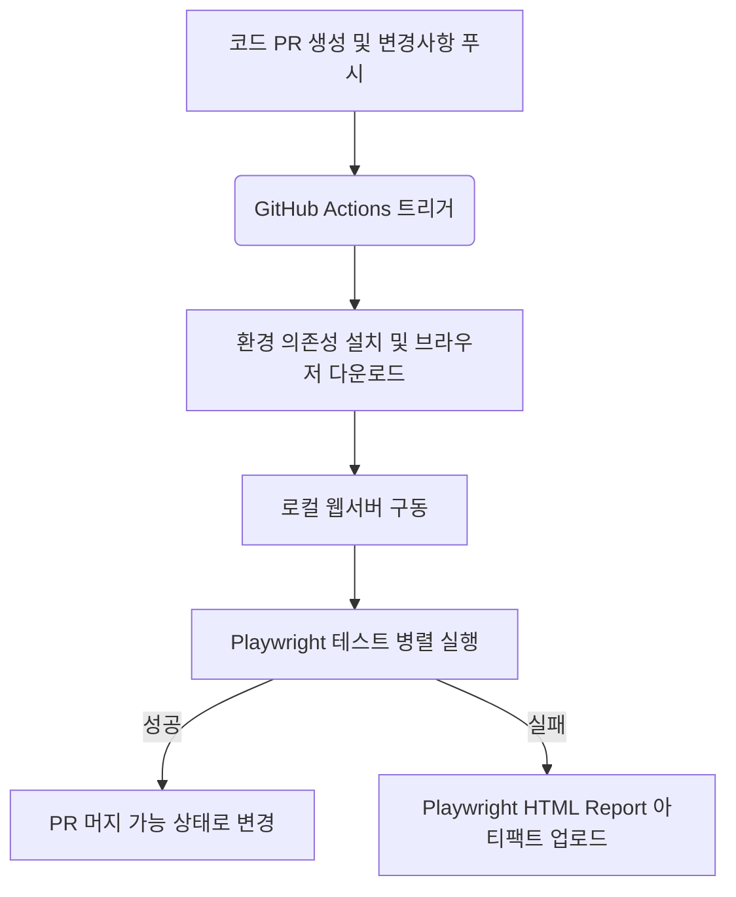

# Mcar Playwright QA

[](https://github.com/your-username/your-repo/actions/workflows/playwright.yml)
[](https://playwright.dev/)
[](https://www.typescriptlang.org/)

프론트엔드 서비스의 UI 신뢰성 및 비즈니스 핵심 시나리오 작동을 지속적으로 검증하기 위해 구축한 Playwright 기반의 E2E 테스트 자동화 환경입니다. GitHub Actions를 이용한 CI/CD 빌드 단계에서의 검증과 시각적 회귀 테스트(Visual Regression) 설정을 포함하고 있습니다.

---

## 주요 검증 가치

1. 비즈니스 리스크 방지
   * 견적 신청 및 폼 입력 프로세스 등 핵심 사용자 시나리오에서 렌더링 깨짐이나 로직 오류가 발생하는 것을 사전에 감지합니다.
2. 반응형 레이아웃 검증
   * 데스크톱(Chromium) 및 모바일(iOS Safari, Android Chrome) 뷰포트에 따른 동적 화면 변화를 확인합니다.
3. PR 단계에서의 자동 검증
   * 깃허브 Pull Request 단계에서 테스트 파이프라인이 자동 구동되어, 버그가 포함된 코드가 브랜치에 병합되는 일을 차단합니다.

---

## 기술 스택 및 구조

* 테스트 러너: Playwright, TypeScript
* 구조 디자인: Page Object Model (POM) 패턴을 적용해 페이지 요소 식별자와 테스트 비즈니스 로직을 격리하여 관리합니다.
* 모킹: Playwright Route API를 사용한 Mocking 처리로 외부 백엔드 API 장애와 무관하게 프론트엔드 단독 E2E 테스트를 수행합니다.

### 디렉토리 구조

```text
encar-playwright-qa/
├── .github/workflows/
│   └── playwright.yml         # CI/CD 파이프라인 정의
├── src/
│   └── pages/
│       └── sell-my-car.page.ts # Page Object 클래스
├── tests/
│   ├── fixtures/
│   │   └── validation-data.json # 모의 데이터
│   └── integration/
│       ├── sell-my-car-validation.spec.ts  # 입력 유효성 검증
│       ├── sell-my-car-mock.spec.ts        # API 모킹 검증
│       ├── sell-my-car-responsive.spec.ts  # 반응형 UI 검증
│       └── visual.spec.ts                  # 시각적 회귀 테스트
├── playwright.config.ts       # 글로벌 실행 환경 설정
├── package.json
└── README.md
```

---

## 실행 가이드

### 1. 개발 환경 설정
실행을 위해 Node.js 환경이 요구됩니다.

```bash
# 의존성 패키지 설치
npm install

# Playwright 전용 브라우저 및 시스템 종속성 설치
npx playwright install --with-deps
```

### 2. 테스트 구동

```bash
# 전체 테스트 실행
npx playwright test

# 시각적 회귀 테스트 실행
npx playwright test tests/integration/visual.spec.ts

# 결과 보고서 확인
npx playwright show-report
```

---

## CI/CD 파이프라인 구성

코드가 PR 또는 main 브랜치로 푸시될 때 GitHub Actions 워크플로우를 트리거합니다.



* 실패 시 추적을 돕기 위해 실패 건에 한해서만 Trace 및 화면 녹화 비디오를 수집하도록 설정하여 리소스를 관리합니다.

---

## 테스팅 이슈 해결 기록 (Troubleshooting)

### 1. 렌더링 미세 편차로 인한 플래키(Flaky) 테스트 대응
* 원인: 폼 포커스 시의 커서 깜빡임 현상이나 실시간 시간 렌더링 영역으로 인해 시각 테스트가 깨지는 현상 발생.
* 해결: `toHaveScreenshot()` 설정에서 변동성이 심한 요소를 `mask` 옵션에 전달하여 시각 비교 대상에서 제외하고, `maxDiffPixelRatio: 0.05`를 주어 렌더링 허용 한도를 조정해 빌드 안정성을 확보했습니다.

### 2. OS 환경 차이로 인한 폰트/안티앨리어싱 불일치
* 원인: 로컬 맥북 환경과 GitHub Actions Ubuntu 러너 환경 간 기본 한글 폰트 차이로 E2E 스크린샷 픽셀 테스트가 깨지는 현상 발생.
* 해결: 깃허브 빌드 및 로컬 환경에서 동일한 리눅스 기반 Playwright Docker 이미지를 통일되게 구성해 기준(Baseline) 스냅샷을 관리하여 플랫폼 독립적인 검증 환경을 갖췄습니다.
